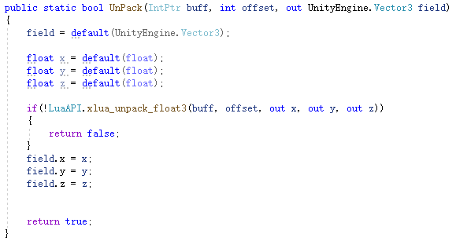
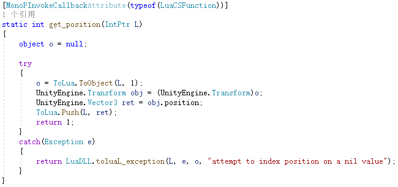

# Unity中xLua与toLua对Vector3的优化

#### 目录
1. 概述

	1.1 Vector3的定义
	
	1.2 主要优化的是什么？

2. xLua对Vector3的优化

	2.1 xLua创建Vector3
	
	2.2 xLua获取Vector3 -- C#的Vector3传入lua
	
	2.3 xLua 设置 Vector3到C#
	
	2.4 GCOptimize -- `PushUnityEngineVector3`的由来

3. toLua对Vector3的优化

	3.1 toLua创建Vector3
	
	3.2 toLua获取Vector3 -- C#的Vector3传入lua
	
	3.3 toLua 设置 Vector3到C#

4. xLua与toLua对Vector3的优化的区别

	4.1 效率性能的比较
	
	4.2 扩展性的比较


#### 一. 概述
1. Vector3的定义

	`public struct Vector3`，是一个struct 结构体，值类型。

2. 主要优化的是什么？

	主要优化 减少gc + 减少lua与C#的交互。

2. 为什么会产生gc？

	原因是boxing（装箱）和unboxing（拆箱）。Vector3（栈）转为object类型需要boxing（堆内存中），object转回Vector3需要unboxing，使用后释放该object引用，这个堆内存被gc检测到已经没引用，释放该堆内存，产生一个gc内存。

3. 如何优化gc？

	值拷贝


#### 二. xLua对Vector3的优化
1. xLua创建Vector3

	lua中有2种方式可以表示Vector3：

	1.1 创建Vector3对象，使用userdata：`CS.UnityEngine.Vector3(7, 8, 9)`

	1.2 调用UnityEngineVector3Wrap中函数 `static int __CreateInstance(RealStatePtr L)`

	1.3 C#中new一个Vector3：`UnityEngine.Vector3 __cl_gen_ret = new UnityEngine.Vector3(x, y, z);`

	1.4 `translator.PushUnityEngineVector3(L, __cl_gen_ret);`
	
	要注意的是push方法是`PushUnityEngineVector3`，普通是`translator.Push`

	<div align="left">
	  
	</div>

	1.5 `PushUnityEngineVector3`做的优化是申请一块userdata（size=12），将Vector3拆成3个float，Pack到userdata，push到lua

	<div align="left">
	  
	</div>

	<div align="left">
	  
	</div>

	1.6 这种Vector3 userdata传给C#后，有一个与Pack对应的UnPack 过程。

2. Table替代 :  `{x = 1, y = 2, z = 3}`

	创建时，不与Unity C#交互(这与toLua类似)

	2.1 传给C#后，在C# `UnPack` 这个table，取出x、y、z， 赋值给new Vector3使用。`UnPack` 在5.5中说明。

	2.2 xLua获取Vector3 -- C#的Vector3传入lua
	
3. lua中 aTransform.position获取Vector3坐标：

	3.1 `UnityEngineTransformWrap. _g_get_position`  lua想从transform获取position

	<div align="left">
	  
	</div>

	3.2 获取C# transform对象：`UnityEngine.Transform __cl_gen_to_be_invoked = (UnityEngine.Transform)translator.FastGetCSObj(L, 1);`

	3.3 `translator.PushUnityEngineVector3(L, __cl_gen_to_be_invoked.position);` 这和2.1中创建一个Vector3 push userdata到lua过程一致。

4. xLua 设置 Vector3到C#

	lua中 aTransform.position = Vector3坐标：

	4.1. `UnityEngineTransformWrap. _s_set_position`,  lua想把pos设置到transform.position

	<div align="left">
	  
	</div>

5. 设置position有2.1中的2种方式：

	5.1 创建Vector3对象：`aTransform.position = CS.UnityEngine.Vector3(7, 8, 9)`

	5.2 Table替代 :  `aTransform.position = {x = 1, y = 2, z = 3}`
	
	直接调用 `CopyByValue.UnPack`，将Table的x，y，z值取出，设置到out UnityEngine.Vector3 val

	<div align="left">
	  
	</div>

	5.3 `CopyByValue.UnPack`
	上面2种方式调用的 `CopyByValue.UnPack`实现不同;

	5.4 userdata的方式，Pack的时候，使用`xlua_pack_float3`,对应的UnPack过程使用`xlua_unpack_float3`,解出userdata struct.

	<div align="left">
	  
	</div>

	5.5 lua table,从栈中依次读取3个float值。

	<div align="left">
	  
	</div>

6. GCOptimize -- `PushUnityEngineVector3`的由来

	6.1 为何Vector3的push到lua 会有一个针对优化的接口`PushUnityEngineVector3`？
	
	Vector3 struct配置了GCOptimize属性（对于常用的UnityEngine的几个struct，Vector系列，Quaternion，Color。。。均已经配置了该属性），这个属性可以通过配置文件或者C# Attribute实现；

	<div align="left">
	  
	</div>

	6.2 从GCOptimize列表中去掉Vector3 会怎么样呢？
	
	`PushUnityEngineVector3`接口就不存在了，而Vector3的push到lua会使用`translator.Push(L, __cl_gen_ret)`; ，不做优化`public void Push(RealStatePtr L, object o)1`，会产生boxing（装箱）和unboxing（拆箱），代表着一个gc。

	<div align="left">
	  
	</div>

#### 三. toLua对Vector3的优化

1. toLua创建Vector3

	```lua
	Vector3.New(x, y, z)
	```

	toLua并没有跟Unity C#交互.

	toLua获取Vector3 -- C#的Vector3传入lua
	
2. lua中 aTransform.position获取Vector3坐标：

	2.1 C#  `UnityEngine_TransformWrap.get_position`；调用ToLua.Push

	<div align="left">
	  
	</div>

	2.2 C#传入Vector3的x，y，z；

	<div align="left">
	  
	</div>

	2.3 在lua建一个lua table，把x，y，z设置为对应字段；

	2.4 设置该table的metatable为`Vector3.lua`的方法实现；

3. toLua 设置 Vector3到C#

	3.1 从栈中取出对应table的x，y，z字段

	<div align="left">
	  
	</div>

	3.2 C# new一个Vector3，将x，y，z赋值到Vector3；
	与xLua的table替代方式非常类似。

#### 四. xLua与toLua对Vector3的优化的区别

1. 效率性能的比较，toLua高

2. xLua与toLua都不产生gc

3. xLua在创建Vector3的userdata方式和Vector3的方法调用，都需要跟Unity C#交互；而toLua在这两方面是纯Lua端执行，无需跟Unity C#交互，效率最高。

4. xLua有一个特点：所有无GC的类型，它的数组访问也没有GC。

5. 扩展性的比较，xLua高

	toLua重新Lua实现的类,需要增加一种新的值类型十分困难, 数量有限,并且与Unity C# Vector3核心代码深度耦合。

	<div align="left">
	  
	</div>

6. xLua支持的struct类型宽泛的多，包含枚举，用户要做的事情也很简单，用GCOptimize声明一下类型即可。支持自定义struct。（struct要求1.含无参构造函数  2.只包含值类型，可以嵌套其它只包含值类型的struct）